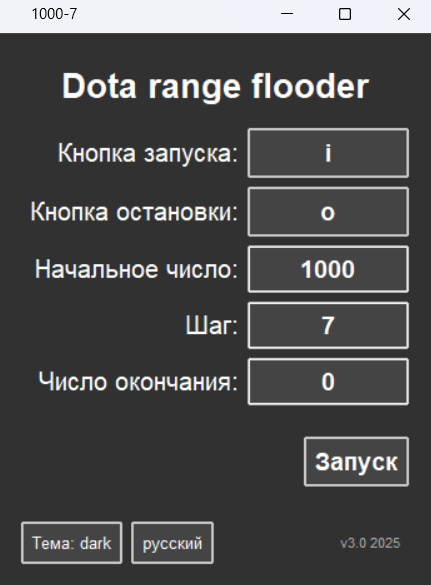

# Dota 2 Range Flooder

## Языки
**[Английский](README.md)**

## Внешний вид

## Примечания

>Кнопки запуска и остановки войдут в режим записи клавиши после нажатия

>Если `Окончательное число` меньше чем `Начальное число` `Шаг` будет вычитаться, иначе он будет прибавляться

>Если поставить кнопку запуска `F9` программа дополнительно подождёт 3 секунды

